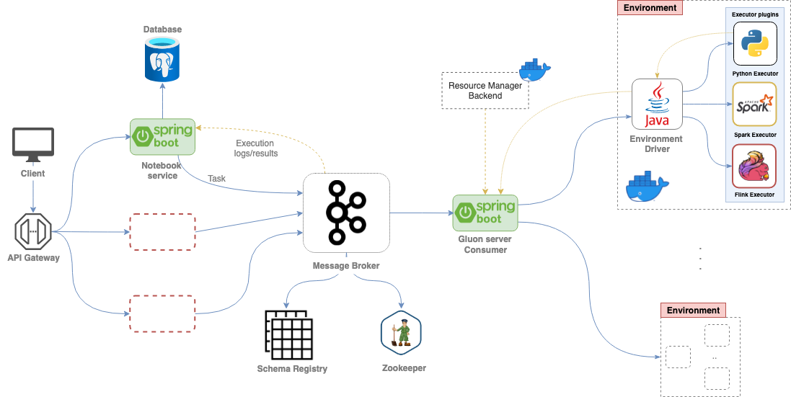

* Editing in progress. Currently there are only diagrams giving an overview of the different platform features.

# Gluon - Data Analytics Platform

About

## Table of Contents

- [Architecture](#architecture)
- [Gluon Server](#gluon-server)
  - [Resource Management](#resource-management)
  - [Task Handling](#task-handling)
- [Execution Environment](#execution-environment)
  - [Environment Driver](#environment-driver)
  - [Plugin Loading](#plugin-loading)
  - [Tasks](#tasks)
- [Executor](#executor)
  - [Python Executor](#python-executor)
  - [PySpark Executor](#pyspark-executor)
- [Notebook Service](#notebook-service)
- [Communication](#communication)

## Architecture

Gluon platform architecture overview.

  

## Gluon Server

### Resource Management

Components which enable resource management.

  

<!-- ### Task Handling -->

## Execution Environment

Placement of the execution environment with respect to other components.

  

<!-- ### Environment Driver -->

### Plugin Loading

The figure below shows how executor isolation is achieved using multiple instances of Plugin ClassLoader.

  
  

<!-- 
### Tasks

## Executor

### Python Executor

### PySpark Executor

## Notebook Service

## Communication
-->

